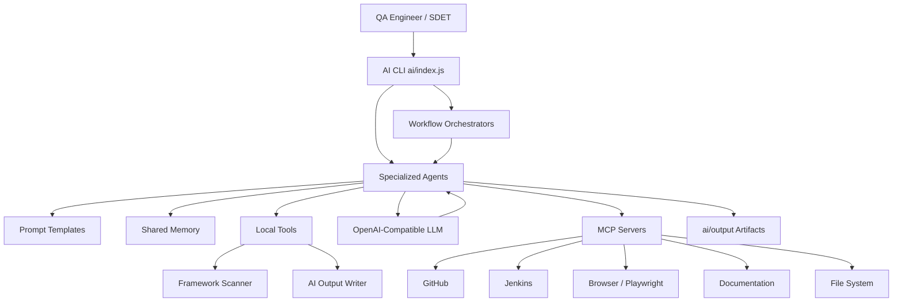
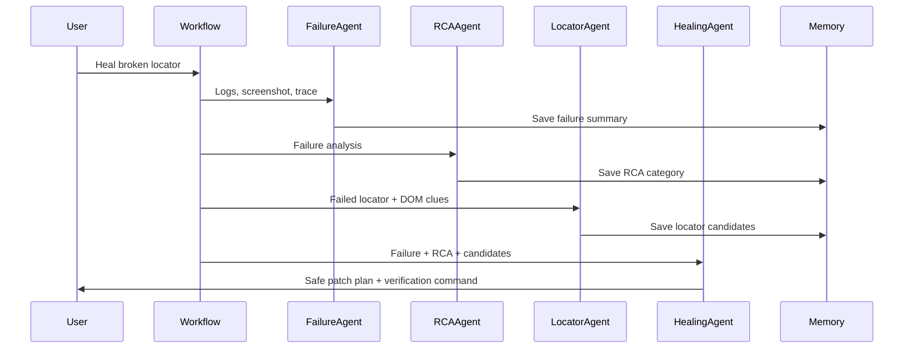
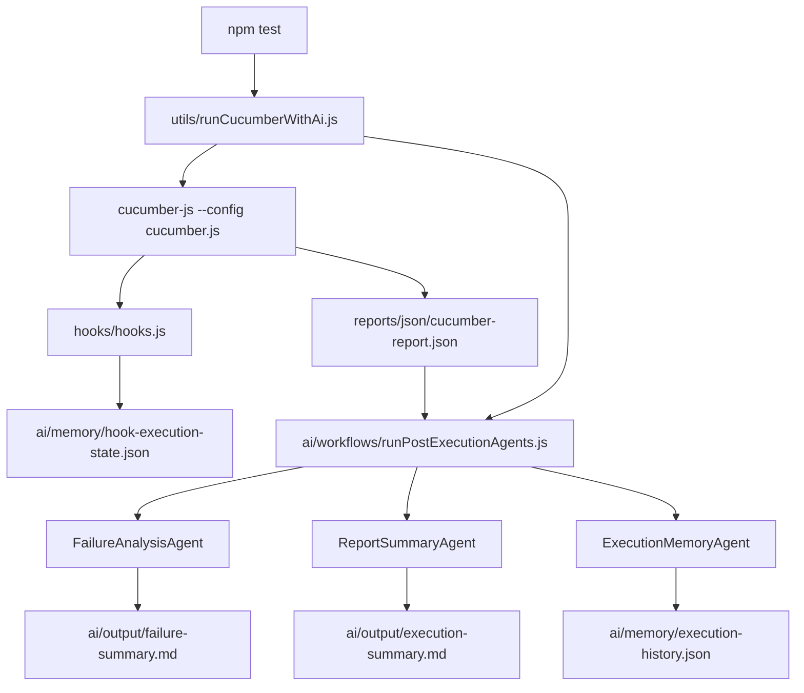

# AI-Assisted Automation Platform Architecture

## Current Framework Analysis

The framework is already structured around industry-standard automation layers:

```text
features/ -> step-definitions/ -> pages/ -> BasePage -> Playwright browser
```

Existing strengths:

- Cucumber BDD feature files
- JavaScript step definitions
- Page Object Model classes
- Shared BasePage wrapper methods
- Environment-based config
- Jenkins and GitHub Actions support
- Cucumber, HTML, Allure, trace, screenshot, video, and log artifacts
- Parallel and cross-browser execution support

AI opportunities:

- Generate new test coverage from requirements
- Convert requirements to feature files
- Generate step definitions and page objects that match local patterns
- Heal locators using DOM/screenshot/trace context
- Generate test data safely
- Analyze Cucumber, Playwright, Allure, and Jenkins failures
- Produce RCA and defect reports
- Review Playwright code for flaky patterns
- Summarize reports for leadership

## Agent Architecture



## Agent Responsibilities

| Agent | Responsibility | Inputs | Outputs |
|---|---|---|---|
| Test Case Generation Agent | Converts requirements into test case coverage | Requirement, user story, acceptance criteria | Markdown test case table |
| Feature File Generation Agent | Converts test cases into Gherkin | Test cases, existing feature style | `.feature` content |
| Step Definition Generation Agent | Creates Cucumber JS steps | Feature file, page object context | JS step definition code |
| Page Object Generation Agent | Creates page classes | Page description, DOM hints, feature steps | JS page object code |
| Locator Healing Agent | Repairs broken locators | Failure log, DOM, screenshot, current locator | Ranked locator suggestions |
| Test Data Generation Agent | Creates test data | Data requirement, schema, boundary rules | JSON data |
| Failure Analysis Agent | Explains failures | Cucumber output, screenshots, traces, logs | Failure report |
| Root Cause Analysis Agent | Classifies cause | Failure analysis, evidence | RCA category and fix |
| Report Summarization Agent | Summarizes runs | Cucumber/Allure/Jenkins reports | Executive summary |
| Jenkins Build Failure Analysis Agent | Diagnoses CI failures | Jenkins console log, stages, artifacts | Build failure analysis |
| API Test Generation Agent | Creates API test coverage | API requirement/spec | API test plan/code |
| Playwright Code Review Agent | Reviews framework code | Changed files, PR diff, framework scan | Review findings |
| Self-Healing Automation Agent | Coordinates healing | Failure + RCA + locator suggestions | Patch plan |

## Agent Communication Flow



## Runtime Execution Flow



## Shared Memory Design

Memory file:

```text
ai/memory/shared-memory.json
```

Stores:

- framework summaries
- agent outputs
- workflow history
- failure signatures
- locator healing decisions
- generated artifacts

This is intentionally simple JSON so it is easy to inspect and explain in interviews. In enterprise environments, this can evolve into a vector database or knowledge store.

## MCP Usage

MCP servers should be used when agents need trusted external or tool-specific context:

- GitHub MCP: pull requests, diffs, code ownership, issues
- File System MCP: local file reads/writes and generated artifacts
- Playwright MCP: live browser state, DOM snapshots, trace inspection
- Jenkins MCP: logs, stages, artifacts, build history
- Browser MCP: local UI inspection and visual verification
- Documentation MCP: official API/library docs

## Concepts

LLM:
An LLM reads context and produces reasoning, code, summaries, or recommendations.

Agent:
An agent is an LLM-backed specialist with a role, prompt, tools, inputs, outputs, and memory.

Prompt:
A prompt is the instruction template that defines behavior and output format.

Tool:
A tool is local executable capability, such as scanning files or writing output.

MCP:
MCP standardizes how the agent connects to external systems like GitHub, Jenkins, browsers, and docs.

Memory:
Memory stores reusable context and previous agent results.

## Implementation Plan

1. Keep the existing framework stable.
2. Add `ai/` as a separate architecture layer.
3. Scan framework context before every AI request.
4. Use specialized agents instead of one generic AI prompt.
5. Store outputs in `ai/output/`.
6. Use MCP for external integrations.
7. Keep generated patches reviewable by humans before applying.
8. Add CI integration only after local workflows are stable.

## Interview Explanation

This framework has been extended into an AI-assisted automation platform. The existing Playwright Cucumber Page Object framework remains unchanged as the execution engine. The AI layer sits beside it under `ai/` and uses specialized agents for test generation, locator healing, failure analysis, RCA, reporting, Jenkins diagnostics, API test generation, and code review. Agents use prompt templates, local tools, shared memory, and OpenAI-compatible LLM calls. MCP servers are used when agents need external context from GitHub, Jenkins, browser sessions, Playwright traces, file systems, or official documentation.
